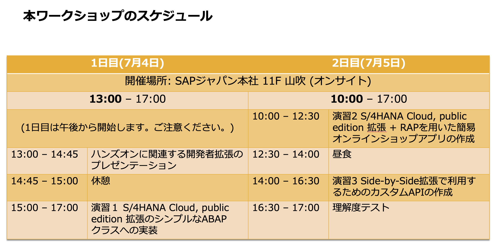

# SAP S/4HANA Cloud, Public edition ABAP拡張ブートキャンプ (2023年7月4-5日開催)

## 事前準備    
### 当日のセッションで利用するご自身のPCにABAP Development Tool (ADT)のインストール     
- ADTはVersion 3.16以上であること
- ご参考情報: [ADTインストール手順](https://developers.sap.com/tutorials/abap-install-adt.html )
- 当日SAPジャパン社内で利用するWifiアクセスは当日ご連絡をさせていただきます。

### 未参加の方のみ: Webiner「S/4HANA Cloud, public editionの拡張オプションのご紹介」資料(2023年6月8日開催)のご確認
1. [クラウドとオンプレにおけるSAP S/4HANAのためのクラウド拡張オプションの”超”概要​](Preparations/SAPS4HANApublicCloud_extensibilityOptions.pdf)
2. [SAP S/4HANA Cloud, public edition 3SLの移送管理](Preparations/Day2_2_3SL_TransportManagement_Public_translated.pdf)

## スケジュール

## コンテンツ
### プレゼンテーション (準備中)
### 演習1: [単純なABAPクラスの拡張とテスト実行](Exercise_1/DRAFT_Exercise1_developerExtensibilities.pdf)
### 演習2: [RAPによる簡易オンラインショップアプリの開発](Exercise_2/DRAFT_Exercise2_developerExtensibilities.pdf)
### 演習3: [Side-by-Side拡張のためのカスタムAPIの開発](Exercise_3/DRAFT_Exercise3_developerExtensibilities.pdf)
### [理解度テスト](https://performancemanager.successfactors.eu/sf/learning?destUrl=https%3a%2f%2fsaplearninghub%2eplateau%2ecom%2flearning%2fuser%2fdeeplink%5fredirect%2ejsp%3flinkId%3dPROGRAM%5fDETAILS%26programID%3dPE%5fKB%5fS4HC%5fABAP%5fDEVS4%26fromSF%3dY&company=learninghub) 
- 要SAP Universal IDもしくはSユーザーID *SAP Universal IDについては[こちら](https://www.sap.com/japan/account/universal-id.html)をご覧ください。
- 日本語/英語選択可能
- 80%以上正解で合格&バッジ獲得
- 何度でも受講可能
